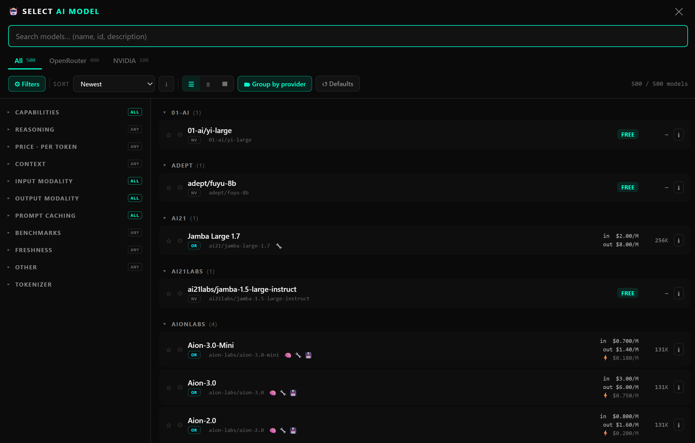
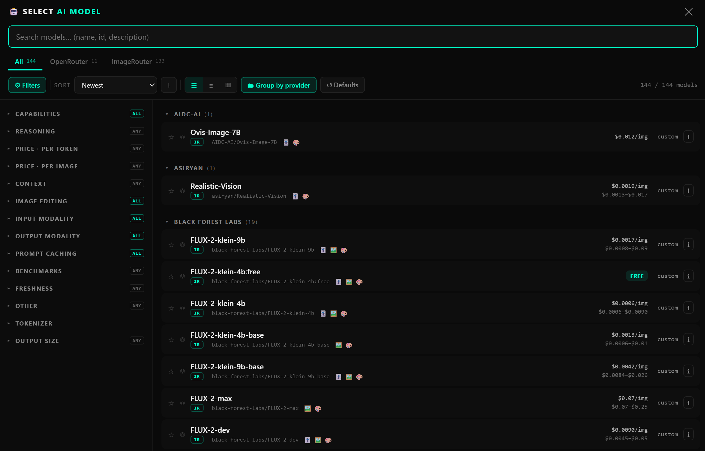

<div align="center">

# 🤖 model_selector.js

<b>A single-file, dependency-free AI model picker modal.</b><br>
A themed, searchable, faceted list of models from one or more catalogs — hands the picked model id back to you.

<p>
  <a href="https://juanpe500.github.io/ai_model_selector/demo/"></a>
  <a href="LICENSE"></a>
  
  
  
</p>



</div>

No framework, no build step, no imports — it injects its own `<style>` and reads a few `window`
globals. Point it at one or more model catalogs; it renders the picker and hands you back the id.

**▶ [Live demo](https://juanpe500.github.io/ai_model_selector/demo/)** — loads three
real public catalogs (OpenRouter, NVIDIA, ImageRouter) and drives the component.

This is the **centralized** version, merged from three copies that had drifted apart across projects:

- **ImageRouter** support (image-generation models, per-image pricing, image editing facets)
- **Responsive** collapsible sidebar (off-canvas drawer on mobile)
- **NVIDIA** as a first-class source (free, OpenRouter-shaped catalog)

---

### One component, every modality

Ask for `text` and you get text models with per-token pricing. Ask for `image` output and the same
picker swaps to image models with **per-image pricing**, an **image-editing** facet, and the
ImageRouter source — same search, same facets, same code.



> Every model is tagged with its source and merged into one list, separated by **API tabs**. The tab
> strip only appears when 2+ sources have models for the requested modalities.

---

## Quick start

```html
<script>
  // The HOST fills these — the picker never fetches anything itself.
  window.OPENROUTER_MODELS = /* OpenRouter /models JSON: { data: [...] } */;
</script>
<script src="https://cdn.jsdelivr.net/gh/juanpe500/ai_model_selector@v1.0.0/model_selector.js"></script>
<script>
  ModelSelectorModal.open({
    inputModalities: ['text'],
    outputModalities: ['text'],
    currentModel: 'google/gemini-2.5-flash',
    onSelect: (id, modelObj, api) => {
      // id  = native model id to send to the provider
      // api = which source it came from ('openrouter' | 'nvidia' | 'imagerouter')
      console.log('picked', id, 'via', api);
    },
  });
</script>
```

## The catalog contract

The picker reads catalogs from `window` globals. **You** load them (with whatever
API keys you hold, server-side) and assign them. A catalog that's absent is
simply skipped — the others still render.

| Global | Shape | Notes |
|---|---|---|
| `window.OPENROUTER_MODELS` | OpenRouter `/models` verbatim | Text + image models, per-token pricing. |
| `window.NVIDIA_MODELS` | OpenRouter shape | NVIDIA's OpenAI-style `/models`, enriched host-side into OpenRouter shape (same ids, forced free). |
| `window.IMAGEROUTER_MODELS` | ImageRouter `/v2/models` verbatim | Image output only, per-image pricing. |
| `window.MS_API_STATUS` *(optional)* | `{ <api>: { configured: bool } }` | Marks a tab with ⚠ when the host has no key for that source (browse-only). |

Each is `{ data: [ ...models ] }`. The picker tags every model with its source
and merges them into one list, separated by **API tabs** in the header. The tab
strip only appears when 2+ sources have models for the requested modalities.

### Identity (`uid`)

Rows, favorites and the saved default are keyed by a `uid`: the **bare id** for
OpenRouter, namespaced for the rest (`nv:` NVIDIA, `ir:` ImageRouter). This
matters because NVIDIA mirrors OpenRouter's exact ids — the prefix keeps them
distinct and tells the host which provider to call. `onSelect` always gives you
the **native id** first (prefix stripped), plus the `api` as the third argument.

Host helpers for restoring a saved pick when you only kept the id:

```js
ModelSelectorModal.apiOf('nv:deepseek/deepseek-r1');    // 'nvidia'
ModelSelectorModal.nativeId('nv:deepseek/deepseek-r1'); // 'deepseek/deepseek-r1'
```

## Public API

```js
ModelSelectorModal.open({ inputModalities, outputModalities, currentModel, apis, onSelect });
ModelSelectorModal.close();
ModelSelectorModal.getDefault();          // reads ms_default_model (a uid)
ModelSelectorModal.apiOf(idOrUid);        // → source key
ModelSelectorModal.nativeId(uid);         // → id with any prefix stripped
ModelSelectorModal.labelFor(modelOrId);   // display label for a "Model: ___" chip
ModelSelectorModal.factsFor(modelObj);    // normalized facts object
```

- `apis` *(optional)* — hard-restrict to a subset, e.g. `['openrouter', 'nvidia']`.
- `onSelect(id, modelObj, api)` — `id` is the native id; `modelObj` is the raw
  catalog entry (also carries `_api`); `api` is the source key.

## Adding a new source

Register it once in `MS_APIS` at the top of the file:

```js
const MS_APIS = {
  openrouter:  { label: 'OpenRouter',  abbr: 'OR', unit: 'token', shape: 'openrouter',  global: 'OPENROUTER_MODELS',  uidPrefix: '' },
  nvidia:      { label: 'NVIDIA',      abbr: 'NV', unit: 'token', shape: 'openrouter',  global: 'NVIDIA_MODELS',      uidPrefix: 'nv:' },
  imagerouter: { label: 'ImageRouter', abbr: 'IR', unit: 'image', shape: 'imagerouter', global: 'IMAGEROUTER_MODELS', uidPrefix: 'ir:' },
};
```

`shape` picks the raw parser (`'openrouter'` or `'imagerouter'`) — a new
OpenRouter-shaped source needs no other code. `uidPrefix` must be unique and
non-empty for any source whose ids can collide with another's.

## localStorage keys

`ms_favorites`, `ms_default_model`, `ms_collapsed` (provider groups),
`ms_group_by_provider`, `ms_density`, `ms_facet_collapsed`, `ms_prefs_v3`
(filters + sort).

## Using via jsDelivr

Pin a **tagged release** so consumers don't get surprised by a `main` push:

```
https://cdn.jsdelivr.net/gh/juanpe500/ai_model_selector@v1.0.0/model_selector.js
```

Cut a new git tag (`v1.1.0`, …) each time you improve the picker; every app just
bumps the version in its `<script>` src. (`@latest` tracks the newest release;
omit the tag entirely to track `main` — handy in dev, risky in prod.)

## Local development

```
python -m http.server 8000    # from the repo root
# open http://localhost:8000/demo/
```

`file://` won't work — the demo fetches the catalog fixtures, which browsers
block over the file protocol.

## License

[MIT](LICENSE)
